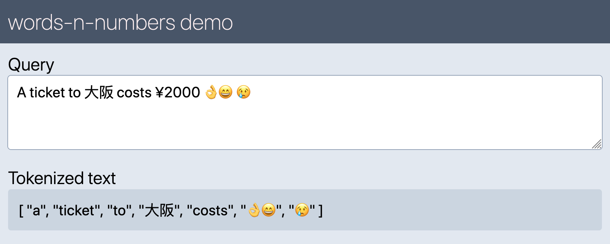

# Words'n'numbers
Tokenizing strings of text. Extracting arrays of words and optionally number, emojis, tags, usernames and email addresses from strings. For Node.js and the browser. When you need more than just [a-z] regular expressions. Part of document processing for [search-index](https://github.com/fergiemcdowall/search-index) and [nowsearch.xyz](https://github.com/eklem/nowsearch.xyz).

Inspired by [extractwords](https://github.com/f-a-r-a-z/extractwords)

[![NPM version][npm-version-image]][npm-url]
[![NPM downloads][npm-downloads-image]][npm-url]
[](https://www.jsdelivr.com/package/npm/words-n-numbers)
[![Build Status][build-image]][build-url]
[![JavaScript Style Guide][standardjs-image]][standardjs-url]
[![MIT License][license-image]][license-url]

## Breaking change

From `v8.0.0` - `emojis`-regular expression now extracts single emojis, so no more "words" formed by several emojis. This because each emoji in a sense are words. You can still make a custom regular expression to grab several emojis in a row as one item with `const customEmojis = '\\p{Emoji_Presentation}'` and then use it as your custom regex.

Meaning that instead of:

```javaScript
extract('A ticket to 大阪 costs ¥2000 👌😄 😢', { regex: emojis})
// ['👌😄', '😢']
```

...you will get:

```javaScript
extract('A ticket to 大阪 costs ¥2000 👌😄 😢', { regex: emojis})
// ['👌', '😄', '😢']
```

## Initiating

### CJS

```javascript
const { extract, words, numbers, emojis, tags, usernames, email } = require('words-n-numbers')
// extract, words, numbers, emojis, tags, usernames, email available
```

### ESM

```javascript
import { extract, words, numbers, emojis, tags, usernames, email } from 'words-n-numbers'
// extract, words, numbers, emojis, tags, usernames, email available
```

### Browser

```html
<script src="https://cdn.jsdelivr.net/npm/words-n-numbers/dist/words-n-numbers.umd.min.js"></script>

<script>
  //wnn.extract, wnn.words, wnn.numbers, wnn.emojis, wnn.tags, wnn.usernames, wnn.email available
</script>
```

## Browser demo
A [simple browser demo of wnn](https://eklem.github.io/words-n-numbers/demo/) to show how it works.

[](https://eklem.github.io/words-n-numbers/demo/)

## Use

The default regex should catch every unicode character from for every language. Default regex flags are `giu`. `emojisCustom`-regex won't work with the `u`-flag (unicode).

### Only words
```javaScript
const stringOfWords = 'A 1000000 dollars baby!'
extract(stringOfWords)
// returns ['A', 'dollars', 'baby']
```

### Only words, converted to lowercase
```javaScript
const stringOfWords = 'A 1000000 dollars baby!'
extract(stringOfWords, { toLowercase: true })
// returns ['a', 'dollars', 'baby']
```

### Combining predefined regex for words and numbers, converted to lowercase
```javaScript
const stringOfWords = 'A 1000000 dollars baby!'
extract(stringOfWords, { regex: [words, numbers], toLowercase: true })
// returns ['a', '1000000', 'dollars', 'baby']
```

### Combining predefined regex for words and emoticons, converted to lowercase
```javaScript
const stringOfWords = 'A ticket to 大阪 costs ¥2000 👌😄 😢'
extract(stringOfWords, { regex: [words, emojis], toLowercase: true })
// returns [ 'A', 'ticket', 'to', '大阪', 'costs', '👌', '😄', '😢' ]
```

### Combining predefined regex for numbers and emoticons
```javaScript
const stringOfWords = 'A ticket to 大阪 costs ¥2000 👌😄 😢'
extract(stringOfWords, { regex: [numbers, emojis], toLowercase: true })
// returns [ '2000', '👌', '😄', '😢' ]
```

### Combining predefined regex for words, numbers and emoticons, converted to lowercase
```javaScript
cons stringOfWords = 'A ticket to 大阪 costs ¥2000 👌😄 😢'
extract(stringOfWords, { regex: [words, numbers, emojis], toLowercase: true })
// returns [ 'a', 'ticket', 'to', '大阪', 'costs', '2000', '👌', '😄', '😢' ]
```

### Predefined regex for `#tags`
```javaScript
const stringOfWords = 'A #49ticket to #大阪 or two#tickets costs ¥2000 👌😄😄 😢'
extract(stringOfWords, { regex: tags, toLowercase: true })
// returns [ '#49ticket', '#大阪' ]
```

### Predefined regex for `@usernames`
```javaScript
const stringOfWords = 'A #ticket to #大阪 costs bob@bob.com, @alice and @美林 ¥2000 👌😄😄 😢'
extract(stringOfWords, { regex: usernames, toLowercase: true })
// returns [ '@alice123', '@美林' ]
```

### Predefined regex for email addresses
```javaScript
const stringOfWords = 'A #ticket to #大阪 costs bob@bob.com, alice.allison@alice123.com, some-name.nameson.nameson@domain.org and @美林 ¥2000 👌😄😄 😢'
extract(stringOfWords, { regex: email, toLowercase: true })
// returns [ 'bob@bob.com', 'alice.allison@alice123.com', 'some-name.nameson.nameson@domain.org' ]
```

### Predefined custom regex for all Unicode emojis
```javaScript
const stringOfWords = 'A #ticket to #大阪 costs bob@bob.com, alice.allison@alice123.com, some-name.nameson.nameson@domain.org and @美林 ¥2000 👌😄😄 😢👩🏽‍🤝‍👨🏻 👩🏽‍🤝‍👨🏻'
extract(stringOfWords, { regex: emojisCustom, flags: 'g' })
// returns [ '👌', '😄', '😄', '😢', '👩🏽‍🤝‍👨🏻', '👩🏽‍🤝‍👨🏻' ]
```

### Custom regex
Some characters needs to be escaped, like `\`and `'`. And you escape it with a backslash - `\`.
```javaScript
const stringOfWords = 'This happens at 5 o\'clock !!!'
extract(stringOfWords, { regex: '[a-z\'0-9]+' })
// returns ['This', 'happens', 'at', '5', 'o\'clock']
```

## API

### Extract function

Returns an array of words and optionally numbers.
```javascript
extract(stringOfText, \<options-object\>)
```

### Options object
```javascript
{
  regex: 'custom or predefined regex',  // defaults to words
  toLowercase: [true / false]             // defaults to false
  flags: 'gmixsuUAJD' // regex flags, defaults to giu - /[regexPattern]/[regexFlags]
}
```

### Order of combined regexes

You can add an array of different regexes or just a string. If you add an array, they will be joined with a `|`-separator, making it an OR-regex. Put the `email`, `usernames` and `tags` before `words` to get the extraction right.

```javaScript
// email addresses before usernames before words can give another outcome than
extract(oldString, { regex: [email, usernames, words] })

// than words before usernames before email addresses
extract(oldString, { regex: [words, usernames, email] })
```

### Predefined regexes
```javaScript
words              // only words, any language <-- default
numbers            // only numbers
emojis             // only emojis
emojisCustom       // only emojis. Works wit the `g`-flag, not `giu`. Based on custom emoji extractor from https://github.com/mathiasbynens/rgi-emoji-regex-pattern
tags               // #tags (any language
usernames          // @usernames (any language)
email              // email addresses. Most valid addresses,
                   //   but not to be used as a validator
```

### Flags for regexes

All but one regex uses the  `giu`-flag. The one that doesn't is the `emojisCustom` that will need only a `g`-flag. `emojisCustom` is added because the standard `emojis` regex based on `\\p{Emoji_Presentation}` isn't able to grab all emojis. When browsers support `p\{RGI_emoji} under a `giu`-flag the library will be changed.

### Languages supported
Supports most languages supported by [stopword](https://github.com/fergiemcdowall/stopword#language-code), and others too. Some languages like Japanese and Chinese simplified needs to be tokenized. May add tokenizers at a later stage.

#### PR's welcome
PR's and issues are more than welcome =)

[license-image]: http://img.shields.io/badge/license-MIT-blue.svg?style=flat
[license-url]: LICENSE
[npm-url]: https://npmjs.org/package/words-n-numbers
[npm-version-image]: http://img.shields.io/npm/v/words-n-numbers.svg?style=flat
[npm-downloads-image]: http://img.shields.io/npm/dm/words-n-numbers.svg?style=flat
[build-url]: https://github.com/eklem/words-n-numbers/actions/workflows/tests.yml
[build-image]: https://github.com/eklem/words-n-numbers/actions/workflows/tests.yml/badge.svg
[standardjs-url]: https://standardjs.com
[standardjs-image]: https://img.shields.io/badge/code_style-standard-brightgreen.svg?style=flat-square
